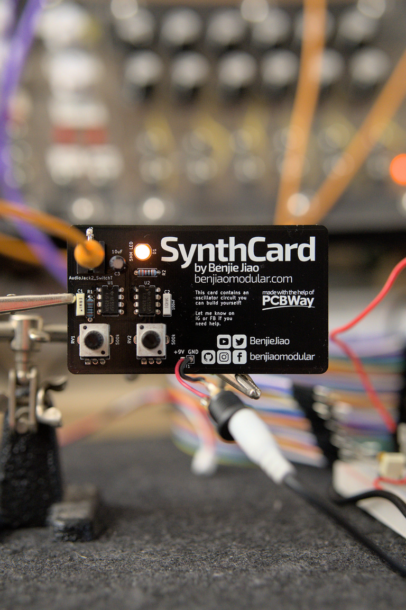

# SynthCard
A businesscard-sized synthesizer module based on the Atari Punk Console.

I designed this project with the help of PCBWay. You can get a copy of these cards through the [PCBWay Shared Projects page](https://www.pcbway.com/project/shareproject/SynthCard_A_business_card_sized_synthesizer_module_84514b6e.html).

Schematics under `/KiCAD`. Gerber files under `/Fabrication`. Panel design under `/Inkscape`.

## Features

This module produces a pulse/square wave at 9Vpp.

There are two knobs. Knob 1 controls the frequency. Knob 2 controls the pulse width.

The module can be powered using a 9V power supply. A battery should work too.
